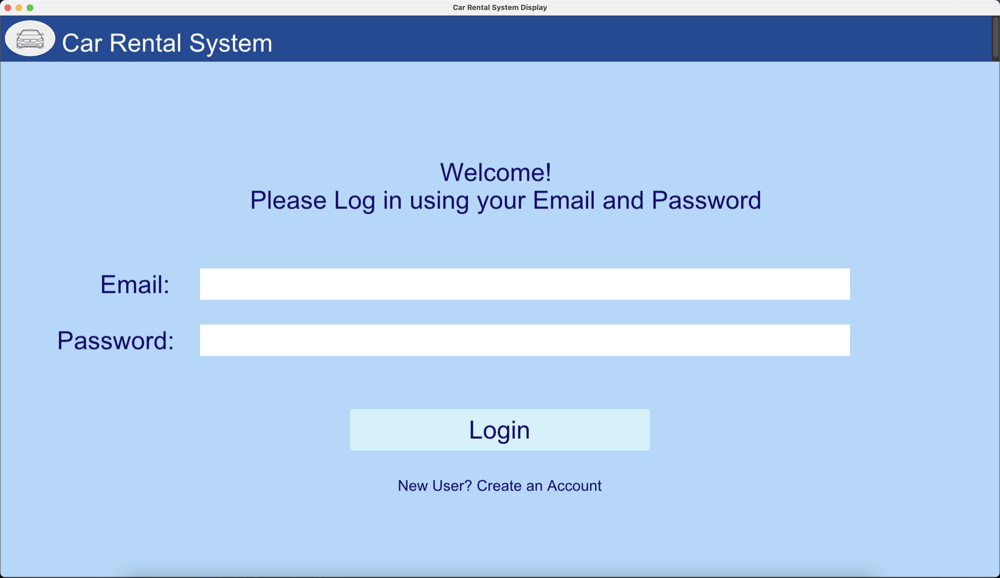

# OOPM
Project for SSE 657 Object Oriented Design Project Methods
Erin Cargin, Dylan DeVries, Jarod Miller, Joel Seepersaud

## Project Description
### Problem
*Car Rental Company* currently uses a manual entry database system, where customers submit a form online, and a representative must manually review the submission and enter the information into their database.  This uses up a lot of valuable time of the representatives, as they have to spend so many hours reviewing rental submissions, looking for available rentals, and communicating with customers.  The company has requested a system instead that will accept the requested rental information from the customer and will automatically show rentals that fit their criteria, allowing the customer to book their rental in real time.  On the back-end, the company's database of available car rentals will also automatically be updated when a customer creates a reservation, allowing the rental company representatives to spend their time in more useful areas.

### Solution
Our group's solution involves a custom database and python application.  The application will allow customers to create an account/login to their account with the rental company, create new reservations, and view their current/upcoming reservations.

#### Login Screen

### Requirements
Detailed product requirements can be found in the document labeled "Documentation/RequirementsSpecification.pdf".

### Process
Our team has opted to work in an Agile environment.  Due to scheduling constraints between team members, we have elected to not meet for a daily scrum, but instead meet every 2 weeks for a sprint planning/retrospective meeting.  During this biweekly meeting, the team discusses our individual work during that 2-week sprint, as well as what each member will complete during the next 2-week sprint.  The team also engages in continued online communication through our Discord group channel. 

### Project Timeline
The project has been split into 5 major milestones.  The Project Introduction milestone encompasses the creation of our project group and brainstorming the problem, solution, and process for the project.  The next four milestones are in the forms of sprints which are reflected in the GitHub issues within this repository.  Sprint one includes the initial requirements document and any model artifacts such as Application, Database, Architecture, and UX diagrams.  Sprint 2 includes most of the development phase, including the database and implementation of UI screens of the application.  Sprint 3 includes the testing and maintenance phase of the application, such as the test plan, risk mitigation plan, and system support plan, as well as the continuous integration of working UIs.  Finally, sprint 4 includes future work or features that the team would like to implement for a final application, but is outside the scope of this project timeline.

The team has elected to use this Gantt chart project timeline planning instead of agile planning.  We have found we work best when delegating the big-picture tasks of each sprint between team members and working on them simultaneously.  This process is reflected in the Gantt chart, as the overall sprint is completed under one timeline, as opposed to each task being tied to a project requirement and having its own timeline.  A full timeline in the form of a Gantt chart can be found under "Documentation/GanttChart.png".  

### Configuration Management
This github repo serves as our SCM database. All of the software features and documents are created in "feature branches" and linked backed to github issues. Once the features have been independendly tested, a pull request is submitted to our "main" branch. At least two developers are required to review and apporve the changes before it will be merged into the baseline branch. For the officially release of our software, we created a protected CM branch. After the software and documents have gone through our final testing and review phase, the main develop branch was merged into the protected CM branch and tagged as our 1.0.0 release. This CM branch will store all of the official software/document releases where we can see all history and changes.

### Installation and Run Instructions
For this application, python 3 is required along with the following packages: 
* dearpygui
* psycopg2

1. To run the application, a user must first clone down our repo. In Windows, you can run powershell or command prompt, while in MacOS/Linux, you can run terminal or another terminal emulator. Use "cd" to navigate to where you would like to install the application. Download by typing "git clone https://github.com/mjmiller20/OOPM" 
2. Run "cd OOPM", then check out our official release tag by typing "git checkout Rental_1.0"
3. Run "cd SSE" to enter the SSE directory. 
4. Ensure you have pythom installed by typing "python --version" on Windows or "python3 --version" on Linux or MacOS. If error is output, follwo instructions to download and install Python here https://www.python.org/downloads/
5. Install dependencies with command "python -m pip install -r requirements.txt" on Windows or "python3 -m pip install -r requirments.txt"
6. Run the main.py by typing "python3 main.py"
7. After doing this the GUI should pop up where the user can create an account and then log in
